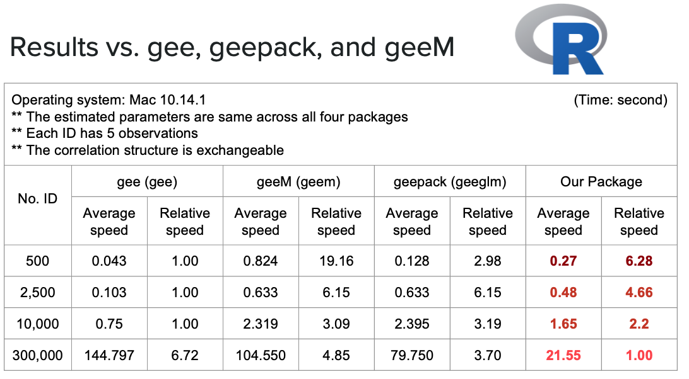

# geeCpp: a C++ package for implementation of generalized estimating equations (GEE)
Hengshi Yu, Tahmeed Tureen, Weiqi Zhou


## Introduction

This is a C++ course project for the statistical computing course. 


## Implementation 

Both `geec_oneloop.cpp` and `geec_twoloop.cpp` provide the C++ implementation of generalized estimating equations (GEE) with Gaussian outcomes. 

After compiling the two cpp files into programs, we can implement GEE on the example data as
```
./gee/geec_oneloop ./data/example_data/studyId.csv ./data/example_data/outcomes.csv ./data/example_data/designX.csv
```

```
./gee/geec_twoloop ./data/example_data/studyId.csv ./data/example_data/outcomes.csv ./data/example_data/designX.csv
```
Users can optionally set an additional fourth arguments of weights in GEE.  

## Performance benchmarks

Compared with several R-based GEE packages on several simulated datasets (in `/data/simulation.R`), the geeCpp gains much better time efficiency.

