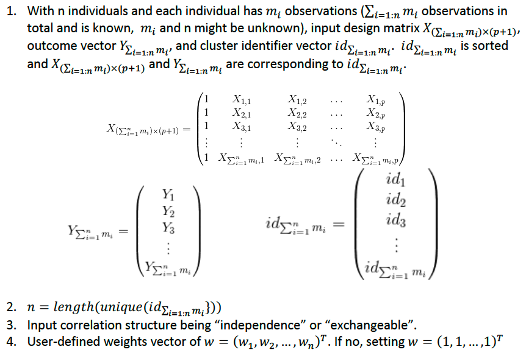
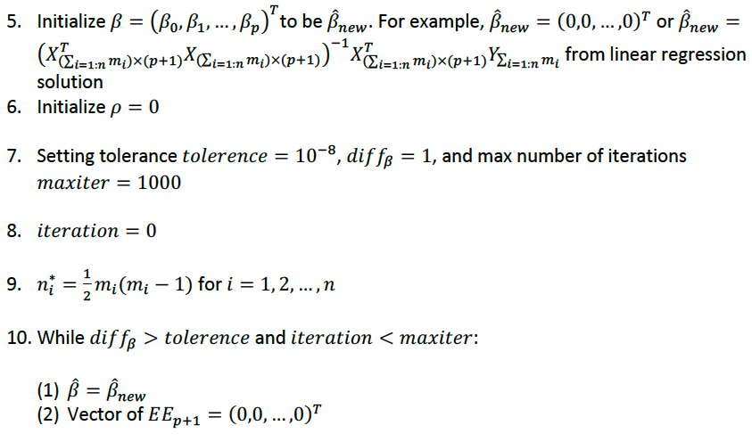
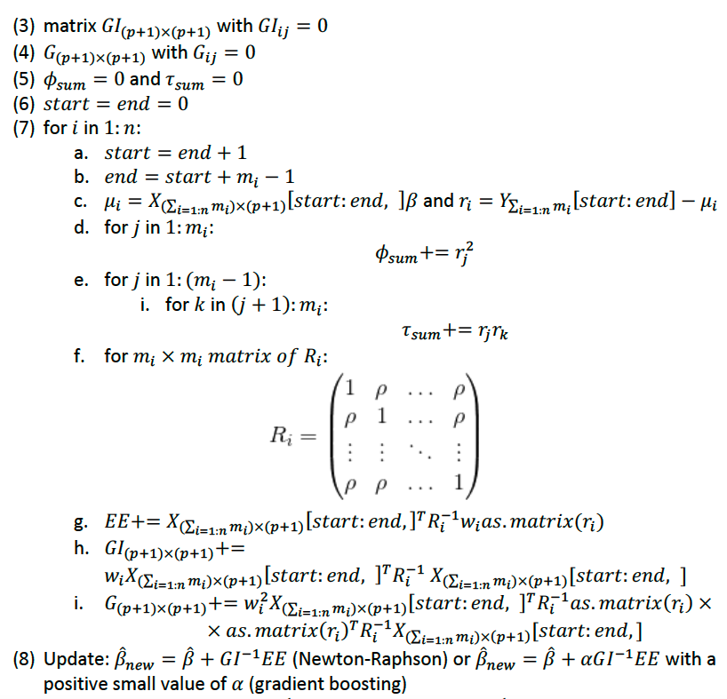
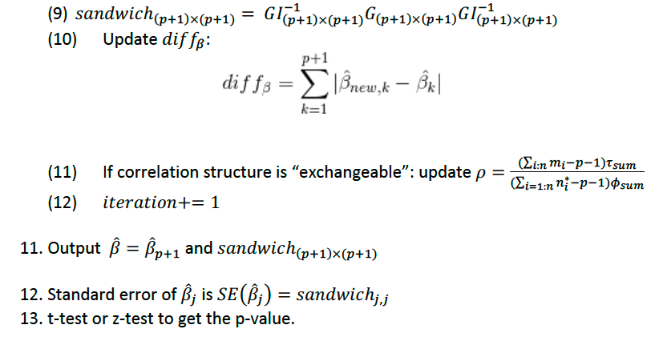

# GEE Algorithm

## References
* Liang, K. Y., & Zeger, S. L. (1986). Longitudinal data analysis using generalized linear models. Biometrika, 73(1), 13-22.
* Zeger, S. L., & Liang, K. Y. (1986). Longitudinal data analysis for discrete and continuous outcomes. Biometrics, 121-130.